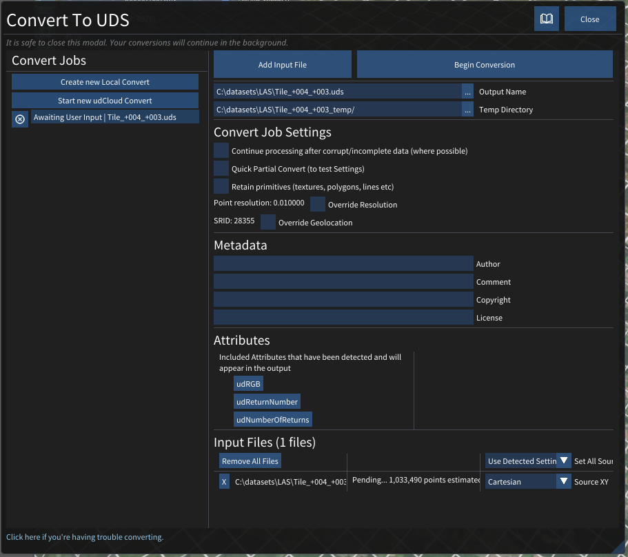
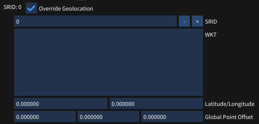

# Convert

The udStream enables users to import 3D models and convert them to Euclideon's Unlimited Detail format (UDS). Euclideon's UDS format enables you to stream and load massive point cloud data sets. udStream Convert currently supports the following file types:

 To access the Convert Window click this icon at the top of the scene explorer.

UDS, UDG, LAS, LAZ, SSF, FBX (Windows & Linux), PTS, PTX, TXT, CSV, XYZ, E57, OBJ, DXF, DAE, SLPK and ASC (Esri)

> If you attempt to drag and drop the file to want to convert on to the Convert Window before typing in the Output Name path and filename, then udStream will report that the file type is not supported.

## Steps to convert

1. Create new Local Convert. Begin by creating a new local convert job, or simply by adding a new file. Drag and drop a file will automatically start a new job. You can add multiple files to a job, and convert will collate them into a single file.
2. Add a supporting input file by clicking "Add Input File" or dropping a support file onto the window. Input files using the FTP, HTTP, HTTPS protocols are supported.
3. Type in the Output Name path and name of the exported UDS file. Ideally, this parameter should be the final target location of the file so that you do not need to copy the file at the end. The system will add the file extension for you. Make sure there is enough space in the target directory to store the entire converted file.
4. Type in the Temp Directory Defaults to the same location as the output file in the previous step. Type C:\\udStream\\convert in the Output Name field and the Temp Directory will default to C:\\udStream\\convert\_temp. Euclideon recommends setting the Temp Directory location to one that resides on a high-speed local drive with plenty of space (rule of thumb: set aside as much space as the uncompressed raw input, as the points in the temporary files have not as yet been compressed), as the convert process will write many small, temporary files. The conversion will remove the temp directory after completion.
5. Optional Selection: **Continue processing after corrupt/incomplete data (where possible)**. If corrupt or incomplete data is detected during a conversion, this setting will decide whether the conversion is cancelled (unticked) or continues (ticked) resulting in a skip of the corrupted points. NOTE: If you tick this setting, the system will not report that it found corrupt or incomplete data.
6. Optional Selection: **Quick Partial Convert** Enabling this option will greatly speed-up the conversion process by only processing 1 in every 1000 points of the input data. This is useful for testing and calibrating the conversion settings before attempting to convert a large and time-consuming job. When imported into the scene the converted model will appear disintegrated and will have 1/1000th of the intended resolution.
7. Optional Selection: **Retain Primitives, (texture, polygons, lines etc).** This option sets the convert context up to retain rasterised primitives such as lines/triangles to be rendered at finer resolutions at runtime
8. Optional Selection: **Override Resolution**. Set to the source size, or it will default to 0.01 if no source size configured. This setting determines the size of the points (in meters) in the point cloud after conversion. It will attempt to find a good size based on the source data but can be set manually by first ticking the "Override Resolution" checkbox and then typing a value in the text field.
9. Optional Selection: **Override Geolocation** If the source data has been correctly geolocated, when you import that file prior to converting it, the file should already have the "Spatial Reference Identifier" (SRID) information filled in this box: search for "EPSG code" or "SRID code" in the metadata. The SRID is the Geotagged ID of the GIS zone for the exported model. If the pre-parse can detect the SRID it will be set automatically. If not, and you wish to correctly geolocate your data, then you can manually select the "Override" checkbox and enter the correct SRID in the text field. It assumes that the input is already in the correct zone. Global Point Offset can be used to add an offset to the x, y and z coordinates of the converted model from that which was specified in the file's metadata, or if not, from the global origin (0, 0, 0).
10. **Metadata**. This section allows you to add related information to the metadata of the output file, such as Author, Comments, Copyright and License holders. The "Copyright" field will be displayed in the bottom of the screen when the model is in the scene. The standard attributes are prefixed with "ud".
11. **Attributes**. This section allows you to remove attributes that were detected in the inputs. Clicking an attribute will remove it from the output, clicking it in the ignored list will bring it back to the included attributes.
12. **Set All Source XY**. The source x and y values can mean a variety of things, for example latitude / longitude, or simply cartesian coordinates. This sets the source x, y values for all files.
13. **Source XY**. Sets the source x and y for a particular file.
14. Input Files panel. The estimated number of points in each file will be shown. During conversion, the progress for each file will also be shown. Here you can also remove any unwanted files.
15. Begin Conversion. udStream will read the file then process and write the points.

The  button beside the convert job in the "Convert Jobs" section allows you to cancel a running convert (it will cancel at the next 'safe' point and clean up temporary files). Once cancelled, the 'Begin Convert' button and the configuration options will reappear enabling you to restart the conversion. After a job has completed the  button also allows you to remove it from the list.

 When the conversion has completed successfully, click the Add to Scene button located at the top of the window. udStream interface will automatically switch to the Scene Window to display your 3D model.

> Euclideon does not recommend running multiple converts at the same time. Converting is a memory and processor intensive process so it is almost always faster to have 1 convert running at a time. udStream helps with this by allowing you to queue multiple jobs to run one after another.

> Tiff conversion now supports world files. A tiff associated world file must have the same file name as the tiff, have the `.tfw` extension, and be located in the same folder. For example, the world file associated with `D:\path\to\file.tiff` would be `D:\path\to\file.tfw`

## Converting in udCloud

You can create convert jobs in udCloud. Pressing  Start new udCloud Convert  will open the convert job in your browser, allowing you to either drag and drop or navigate to your desired files. When your files are selected and uploaded, you can submit the job. You will recieve an email containing a link to the UDS convert result when the conversion is complete.

## Tips for speeding up convert

1. The "Temp Directory" should be a local folder on a fast drive, ideally not the same drive as the output UDS.
2. Copy the inputs locally rather than loading them over the internet

## Converting from Command Line (CMD)

udStream also comes with a separate command line application which allows you to convert files via the command line instead of using the Convert Tab.

The basic syntax is

     `udStreamConvertCMD.exe server username password [options] -i inputFile [-i anotherInputFile] -o outputFile.uds`

Here is an example of what you might see when doing a simple convert of a file 'POINT\_CLOUD.csv' to 'myDataset.uds'.

     `D:\EuclideonConvert>udStreamConvertCMD.exe https:\udStream.euclideon.com username password -i ".\POINT\CLOUD.csv" -o "myDataset.uds"`

> More information on the possible options is shown in the command line when running the udStreamConvertCMD application with no additional parameters

## Override Geolocation

You can override the SRID and WKT information of the scene for the convert.

Check the  Override Geolocation  checkbox to open the override options. Here you can specify the SRID and WKT information.

  - **SRID** Modify the SRID for the convert.
  - **WKT** The Well Known Text version of the SRID.
  - **Latitude** and **Longitude** Change the latitude and longitude of the origin and central meridian of the projection.
  - **Global Point Offset** The XYZ Global position offset of the convert.
