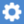
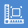

# Scene Explorer

The Scene Explorer window lists the assets currently in your scene.

## Action Bar

The buttons across the top of the Scene Explorer allow quick access to add or remove from the scene.
  -  **Add Scene Item** This button opens the dialog box to add a new UDS, OBJ, SLPK, etc item to the scene. The Path/URL can include files on the local drives, network drives, UNC Paths, HTTP, HTTPS, FTP & FTPS.
  -  **Add Folder** Adds a folder to the scene explorer. This can help with organizing your scene.
  -  **Save Current Camera** Saves the current camera position and rotation as a viewpoint.
  -  **Save Current Camera with Visualisation Settings** Saves the camera as above, along with the current visualisation [settings](./settings.md)
  -  **Add Flythrough** adds a new [flythrough](./flythrough.md) to the scene.
  -  **Add GTFS** adds a new [GTFS](./gtfs.md) to the scene.
  -  **Add Place Layer** adds a new [Place Layer](./places.md) to the scene.
  -  **Add Map Tile** adds a new [Map Tile](./maptiles.md) to the scene.
  -  **Remove Selected** deletes all selected items from the scene.

## Scene Items

The area below the quick menu displays the items in the scene.

### Project Settings

Click the icon to open the [project settings](./projectsetting.md) menu. The project name is also displayed here.

### Show All Items

Click the icon to show all items listed/filtered in the Scene Explorer. The sub-nodes under the folder will also be displayed automatically (even in the collapsed state).

### Hide All Items

Click the icon to hide all items listed/filtered in the Scene Explorer. The sub-nodes under the folder will also be hided automatically (even in the collapsed state).

### Selecting Items

Click on an item in the Scene Explorer to select it. Selected items will appear highlighted.

You can select multiple items in the scene explorer by holding Ctrl and then left-clicking them individually, or shift-clicking to quickly select larger groups. Doing this on a selected item will deselect it.

Single clicking without Ctrl will deselect all items and select just the item you have clicked.

### Filtering Items

Items listed in the Scene Explorer can be filtered by name or type, these can be specified above the list of items. Items that are filtered out will not be selected when performing a shift-click selection (see above).

By type:
 Click this icon to open filter-by-type menu.

Filtered items:

By name(case-insensitive):

### Reorganising the scene

Items or groups of items in the scene explorer can be reordered by holding left-click and dragging them around. A blue line indicates where the item(s) will be after you release them.

### Loading UDS Models

There are two ways to add models to the scene.

1. Drag and Drop
  - On devices with folder exploring you can drag a file from your file explorer and drop it in the scene window to add the model to the scene.
2. Direct URL loading
  - You can type a URL or path in the  "Add Scene Item" popup. The path field at the top of the pane allows URL and network paths to retrieve UDS files.

## Scene Item Properties

Items in the Scene explorer (see Scene Items) can be expanded to give additional information (see below). The type of information displayed depends on the scene item.

## UDS Point Cloud

The expanded properties for UDS files show the path the UDS was loaded from and then a tree view of the internal metadata from the file.

The system displays advanced information like the attributes in the file, their sizes, and how they are blended for level of detail calculations.

## Comparing Models

You can compare two models currently loaded in the scene that were scanned at different times. The model you select in the scene explorer will be the model that will have a distance calculated from each point to a mesh of the model you will select in the steps below. Please note that this process will generate a third model, representing the comparison between the two entered models.

1. Right-click on a model in the scene explorer
2. Select the  Compare Models  option
3. Enter the required information
  a. Model to compare against. When doing a comparison between models from two different dates, this will be the older of the two models.
  b. Ball radius (in metres), this is used to mesh the point cloud. This should be the maximum distance between two points that could be considered part of the same surface.
  c. Grid size (in metres), this is used to split the model up int smaller pieces for processing. This will be the maximum distance a point can be from a point in the old model, points that sit outside all the grids will be displayed with the "No Match" colour when using the displacement visualisation options.
4. Click the  Compare Models  button, this will create a convert job and open the convert window. See Convert section for more information.

## Export using udCloud

You can export a UDS, LAS or OBJ if they are loaded via URL in udCloud instead of on disk.

1. Right click on a model in the scene explorer
2. Select the  Export Pointcloud  option to open the Export Pointcloud modal
3. Enter a filter (optional) and output filename
4. Click the  Export using udCloud  button, this will save the model to udCloud.

The actual exporting occurs in udCloud, and will continue even if udStream is closed. When the export is complete, you will recieve a confirmation email.

## Workflow

  -  **Profile Menu**: Access your profile, change password, export project, sample projects, or to log out.
  -  **New Project**: Allows to create a new project, either geolocated or non-geolocated, or choose a sample project.
  -  **Open Project**: Allows to create a new project, either geolocated or non-geolocated, or choose a sample project.
  -  **Save Project**: Saves the project to a chosen destination.
  -  **Share Project**: If your the current project is saved on the cloud, you can share it with others.
  -  **Convert** opens a popup to [convert](./convert.md) datasets into the UDS format
  -  **Show/Hide Scene Explorer**: Toggle the [scene explorer](./explorer.md) window
  -  **Toggle Viewport** opens a second view that can be controlled independently or used to display a top-down map view that is syncronised with the main viewport.
  -  **Open Settings**: Opens the [Settings](./settings.md) window.
  -  **Show User Guide** opens the [user guide](./index.md).
  -  **Help**: Opens the help drop down.
  -  **Return Camera** Returns the camera the initial starting view.

## Tools

udStream has a range of tools to help you with your workflow.

> (Above) Height measurement tool

  -  **Selection Tool** is the default tool when no other tool is active. It allows you to select items in the scene.
  -  **Voxel Inspector** allows you to inspect the data associated with individual voxels of a UDS file.
  -  **Single Annotation Point** You can add multiple annotation points to the current scene, and alter the name and colour of each annotation point. Simply click on the POI (Point Of Interest) button in the tool bar on the left and click in the scene. Clicking on the POI in the Scene Explorer will give you options to change the size and colours of the displayed text. Right clicking on the POI name in the Scene Explorer will bring up a context menu, where you can edit the POI name, move the camera to the POI in the scene, or remove it.
  -  **Line Measurements** (see [Measuring](./measuring.md))
  -  **Area Measurements** An Area Measurement is used to measure the horizontal area described by 3 or more points. The function is almost identical to the Line Measurement, the only difference being the resulting polygon is closed by default.
  -  **Height Measurements** The height measurement tool is useful when you wish to measure the height, and horizontal distance between two points. Click the height measurement tool from the tool bar on the left-hand side. Click on a point in the scene. Click on a second point to anchor the height measurement.
  -  **Box Filter** Adds a [box filter](./filters.md) to the scene
  -  **Sphere Filter**  Adds a [sphere filter](./filters.md) to the scene
  -  **Capsule Filter** Adds a [capsule filter](./filters.md) to the scene
  -  **Cross Section** Adds a [cross section](./filters.md) to the scene
  -  **Section View** Adds a [section view](./sectionview.md) to the scene
  -  **Add View Shed** Adds a [viewshed](./viewshed.md) to the scene
  -  **Add Media** Adds a media node to the scene
  
### Edit WKT

You can edit the WKT to override the zone information of the scene.

The  Edit WKT  button is visible when both  Show Projection information  and  Show Advanced GIS Settings are checked in Settings->Appearance.

This opens the Edit WKT modal. Here you can specify the SRID and WKT information.

  - **Override SRID** Enter an SRID to override the current one
  - **WKT** The Well Known Text version of the SRID.
  - **Latitude** and **Longitude** Change the latitude and longitude of the origin and central meridian of the projection.

### Compass

Clicking this button will also face the camera north.

### Lock Altitude

Hotkey: **spacebar**

Will keep the camera's height constant (Z-axis lock) when panning with the mouse or strafing with the keyboard.

### Visualisation Settings

A shortcut to open the visualisation section in the [settings](./settings.md)

### 3D / Tracking

This opens the 3D / Tracking modal. Here you can specify the stereoscopic screen coordinates, the stereoscopic mode and the VRPN information.

  - **Screen Coordinates** The xyz coordinates of the bottom left, bottom right and top left of the screen in tracking space.
  - **Stereoscopic Mode** The stereoscopic display mode of udStream.
  - **Enable VRPN** Enables VRPN (Virtual-Reality Peripheral Network) To interface with virtual reality peripherals.

  - **Reset origin** Resets the tracking origin point.
  - **Restore Previous Configuration** Reload previous device configuration.
  - **Add Device** Add a new VR device for tracking. Clicking this opens the following section:
  

  - **Device Type** The tracking type of the device.
  - **Control Type** The object the device is performing tracking on.
  - **Device ID / Host Name** The ID and host name of the device being used.
  - **Add Device** Confirm, create and apply tracking device.

### Fullscreen

Hotkey: **F5**

Toggle fullscreen mode.

### Image POI

To add an image at a specific location, simply drag and drop a png, jpg or a tiff into the scene.

  - **Image Type** Use Image Type to select how you want the image to be displayed:
    -   Standard with display the image as a billboard, that is, always facing the camera
    -   Orientated Image will allow you to change the orientation of the image
    -   Panorama will project the image onto a panoramic cylinder
    -   Photo Sphere will project the image onto a sphere
  - **Thumbnail Size** The size the image will be displayed in the scene
  - **Reload Time (secs)** Reload Time allows you to control how often the image in updated in the scene. This is useful if the image changes over time and should be updated in the scene.
