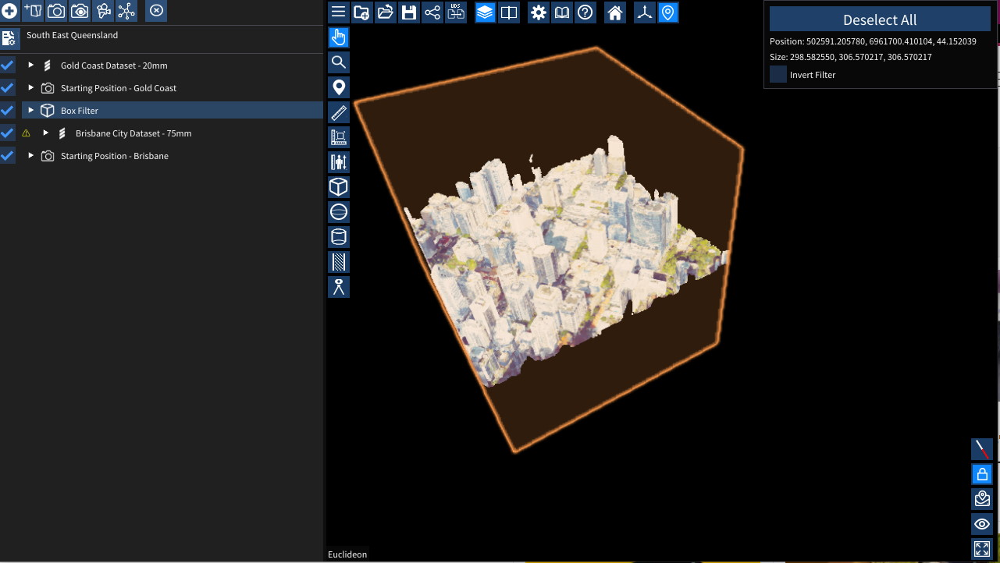

# Filters

The various filters can be used to filter out voxels of the UDS files in the scene or during export. You can change the the position, rotation and size of the filter by setting the appropriate values in the scene explorer. You also use the [gizmos](./gizmos.md) to adjust the transforms.

## Tips for using filters
  - The filter only applies to UDS files that are further down the list in the same folder (or subfolders) in the [scene explorer](./explorer.md).
    - In the screenshot above, the "Brisbane City Dataset - 75mm" is filtered using the "Box Filter" but "Gold Coast Dataset - 20mm" is not as the Gold Coast dataset is above the Box Filter.
  - The "CSG Operation" allows for complex filtering
    - Union will show voxels that match this filter OR the previous filter
    - Intersection will show voxels that match this filter AND the previous filter
    - Replace will override the previous filter and use this one for future models
  - Filter Types:
     Box Filter
     Sphere Filter
     Capsule Filter
     Cross Section Filter
     Polygon Filter

Inverting the filters will remove everything outside the filter.

## Exporting using filters
To export the filtered data, right click on the model you want to export in the Scene Explorer. Choose Export Pointcloud then choose the filter you want to export if you have more than one.

If the "Export Pointcloud" Option doesn't appear, ensure that you are using the model's projection by double clicking the model in the Scene Explorer, or right clicking the model in the Scene Explorer and selecting "Use Projection".
