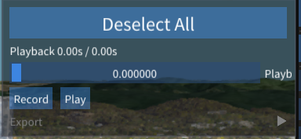
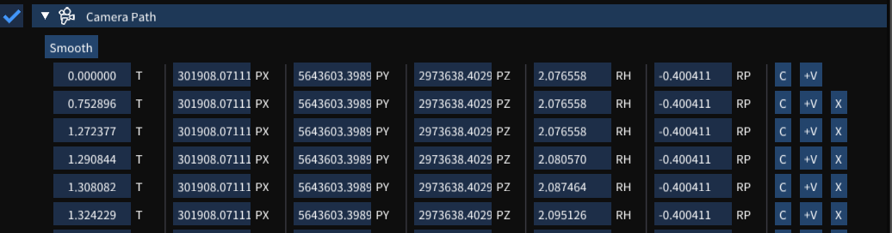

# Paths, Flythroughs and Video Export

This feature allows you to capture, edit and export a 'flythrough' of the camera. To use:
  - Select  **Add Flythrough** from the top of the scene explorer. You should see a window pop up in the scene.

  - Click **Record** to start recording, and move around in the scene.
  - Once you are done, Select **Stop**.
  - You will now have an option to **Export** the flythough with a range of options such as:
    - **Resolution**: 720p, 1080p or 4K
    - **FPS**: Frames Per Second
    - **Export Format**: Export as either a sequence of images, or a MP4 movie file
    - **Export Path**: The path you wish all export files to be placed

Opening the flythrough or _Camera Path_ in the scene explorer will allow you to edit, remove and add frames to the flythrough.

Each frame consists of the following elements:
  - **T**: The timestamp of each frame
  - **PX**, **PY**, **PZ**: The coordinates of the camera at this frame
  - **RH**, **RP**: The heading and pitch of the camera at this frame
  - **C**: Copy the current camera position to this frame's position
  - **+V**: Add a new frame after this one
  - **X**: Delete frame

Addionally, select **Smooth** to smooth out the camera movement over all frames.
