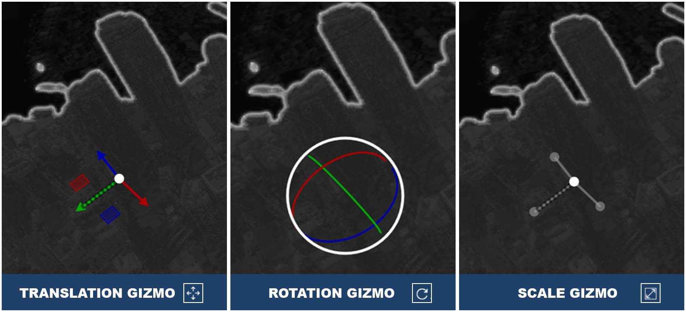
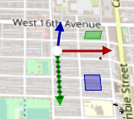
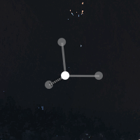

# Gizmos

A "gizmo" is used to move objects around in the scene. When active, the gizmo appears at the origin of an item. Gizmos are disabled by default.

To activate the gizmo tool, do the following:
1.  Select an item in the Scene Explorer window (see [Scene Explorer](./explorer.md)).
2.  Select a gizmo tool from the udStream interface (see [Scene Explorer](./explorer.md)).

In Local Space Mode, the axis will align with the local axis of the last selected item. If the model does not have a local space axis, then the gizmo will use the global axis . Red is the X axis, which in projection space usually corresponds to the EASTING. Green is the Y axis, which usually corresponds to the NORTHING. Blue is the Z axis, which usually corresponds to the ALTITUDE. Looking at the gizmo from different angles will cause one or more of its axes to appear hatched/dashed. This indicates that this axis is pointed in the negative direction.

Use the Translation Gizmo to move scene item(s) around. The translation gizmo has 3 components:
1.  The coloured axis arms of the gizmo will translate only along that axis.
2.  The coloured squares between two axis arms will translate in that plane. For example, the square between the X and Y axes translates only in the XY plane. The colour indicates which axis will not be modified by using that square.
3.  The white circle at the origin of the gizmo will translate the models in the plane perpendicular to the camera.

The Rotation Gizmo changes the orientation of the item(s). Items will rotate around their pivot point, which is ideally the centre of the mass. For UDS models, a pivot point is selected automatically during conversion. Non-UDS models can designate a different pivot point. The rotation gizmo has 2 components:

1.  The coloured rings will each rotate around the axis of that colour (e.g. the Z-axis is blue, so the blue ring rotates everything around the Z-axis).
2.  The white ring rotates everything around the axis parallel to the direction of the camera.

The Scale Gizmo changes the size of the selected item(s). The anchor for scaling is always the centre of the item(s). The scale gizmo has 2 components:
1.  The coloured axis arms of the gizmo can be used to scale along that axis only.
2.  The white circle at the origin of the gizmo will scale uniformly in all directions.

In some situations, you may find parts of the gizmo greyed out. This will happen when the model does not support that action. For instance, UDS files do not support non-uniform scaling. Therefore, that gizmo will be unavailable.

