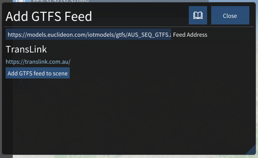
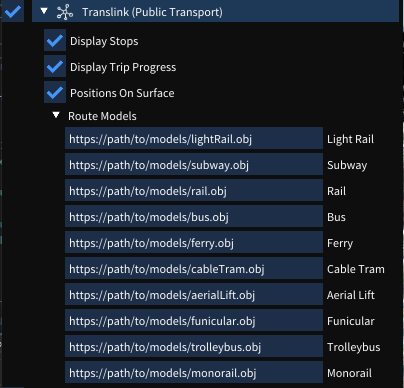

# General Transit Feed Specification

GTFS is a data specification that allows public transit agencies to publish their transit data in a format that can be consumsed by udStream.
GTFS is intended for use by advanced users as it contains features that can cause performance loss if not configured correctly.

## Setup

A GTFS feed can be added to the scene by clicking the  at the top of the Scene Explorer.

The following modal will be opened; the GTFS link should be to the `.zip` file of the GTFS feed.

After the feed is verified; the feed name and URL will appear and the "Add GTFS feed to scene" button will be enabled.

## Customization

Once a GTFS node has been added to the scene, customization options will appear in the Scene Explorer window:

## Stops
Enabling the 'Display Stops' option will display the stop information as labels in the scene viewer window. These stops can be individually selected (in the scene viewer window) to bring up additional information about that stop.

## Trips
Enabling the 'Display Trip Progress' option will display trip information. Each trip has a type, and the system will render the appropriate model URL provded by the user in the 'Route Models' list.
For example, trips that have type 'Subway' type will draw the model provided in the 'Subway' input field.

Selecting a route model in the scene viewer will bring up additional information about that route, including its route path.

## Other Settings
Enabling the 'Positions On Surface' option will query the system for height information for each trip, placing it on the surface of the maps (if DEM is enabled).

> Note! This is an expensive operation, and should be used with caution.
