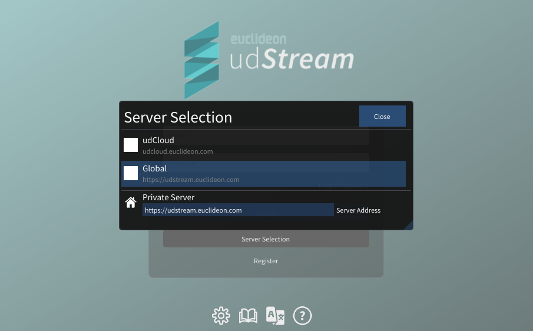
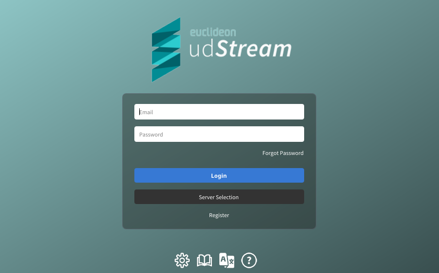
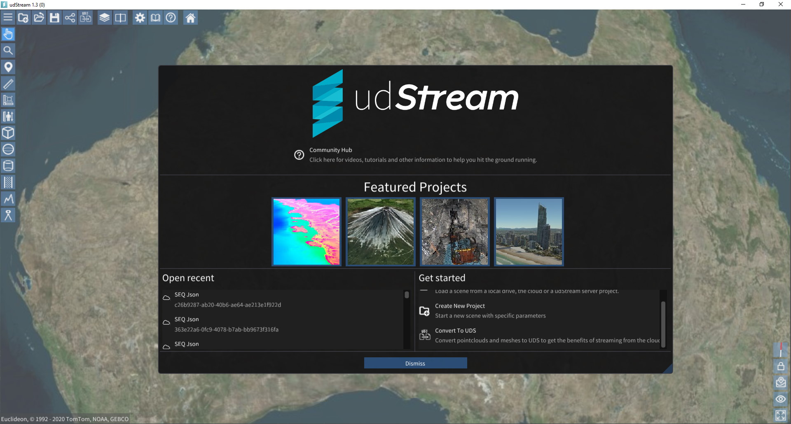
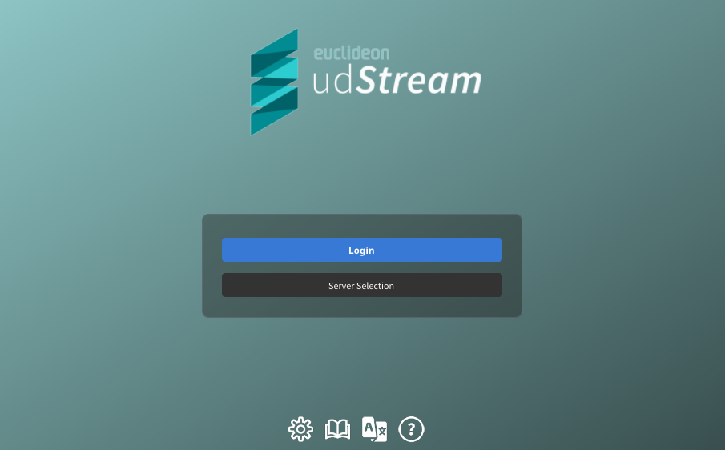
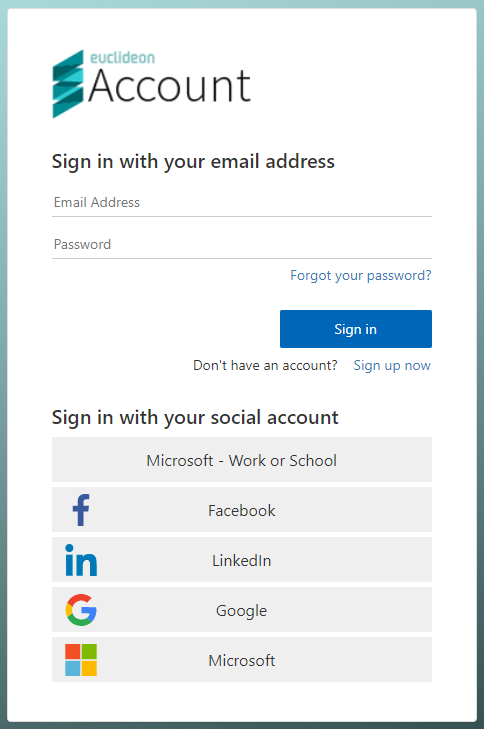

# Logging into udStream

After the application has started, it will present the login or server select screen. If this does not occur, please contact <support@euclideon.com> for assistance.

## Selecting a Server

If the server selection modal does not appear by default, it can be opened by clicking on "Server Selection" on the login screen.

The public servers hosted by Euclideon and it's distribution partners are listed as options that can be clicked to be selected.

A server address can be entered in the text box and the "Close" button in the top left allows for the modal to be closed.

As this modal appears when the program is first launched, it is also possible to override the default language selection on this screen.

## Login Screen

After you have entered your credentials, click Login and you should see an empty scene in the viewport like the image below (actual opening scene may vary).

## Logging In through udCloud

If the server selection is set to udCloud, a udCloud Account will be required to proceed. The login Screen will look like this:

Selecting "Login" will open the udCloud login page in your browser.

Once you have entered your udCloud account information correctly, click the "Sign In" button. The udStream application will open up to the startup screen, and you can safely close the udCloud login tab in your browser.

## Login Errors

**Could not connect to server.**
  - There are several possible causes for this message. The most common is the Server URL entered into the field is not correct. The system is case- and space-sensitive. Ensure there are no spaces before or after the Server URL.

**Username or Password incorrect**
  - This could mean any of the following:
    - The username or password is incorrect
    - The username does not exist
    - The username has been banned
    - You need to ensure there are no unintentional spaces before or after the Username or Password.

**Your clock does not match the remote server clock.**
  - To maintain system security, the client and server must agree on the time to within 5 minutes. Having the server and client both set to synchronize with "universal" NTP time is preferable. This error will occur if the time zone of either the server or the client is not set correctly.

**Could not open a secure channel to the server.**
  - The client was able to connect to the server provided in the server URL field, but an error occurred while verifying the server was the intended target or negotiating an encrypted connection.

**Unable to negotiate with the server, please confirm the server address.**
  - The client was able to connect to the server provided in the server URL field, but the server did not respond as expected. This usually occurs if the server is not a udStream Server.

**Unable to negotiate with proxy server, please confirm the proxy server address**
  - This occurs when the proxy information is partially correct. Further details may be required before the connection through the proxy is correct (usually proxy authentication details).

**Unknown error occurred, please try again later.**
  - This error was not one of the above errors and will require Euclideon Support assistance to resolve. Please contact Euclideon at <support@euclideon.com> or go to <https://euclideon.com> to access our online support and Knowledgebase.

> When an error occurs, press the Alt and Ctrl keys simultaneously to display an additional error code after the message. Email <support@euclideon.com>, giving the udStream version number, error message and code so they can help you resolve the problem. You might use this in situations where you get an Unknown Error Occurred message.
