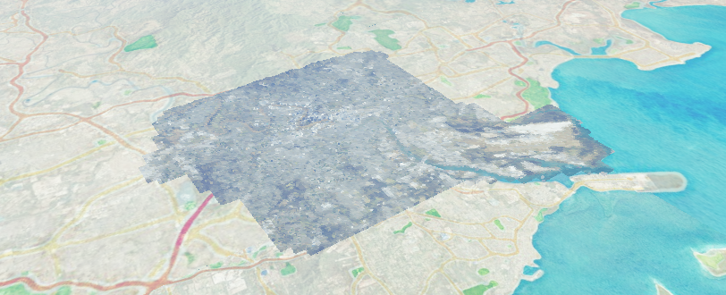
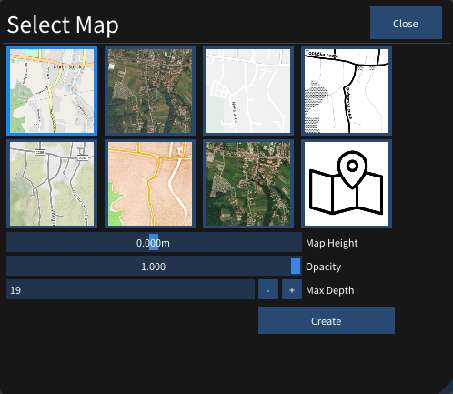
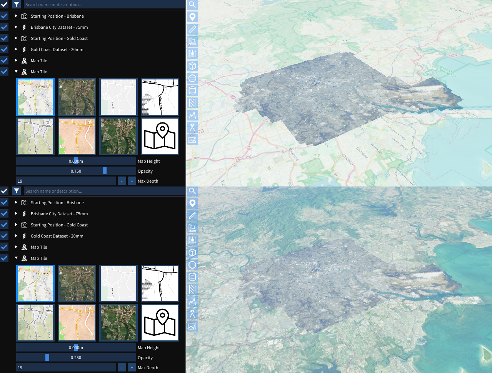

# Map Tiles

The Map Tile feature allows you to render maps from a server to contextualize your geolocated scene onto the real world.

Adding a new map tile can be done by clicking the  Add Map Tile button at the top of the [Scene Explorer](./explorer.md).

You will be prompted by a server selection window: 

Choose from a pre-configured set of map servers. ADVANCED: Checking the "Custom" option will show further options, allowing you to configure your own tile server URL.
  - **Map Height** Offset vertically the map tile positions.
  - **Opacity** Transparency of the map tiles.
  - **Map Depth** The higher the map depth, the more detailed the map tiles will be.

Press the 'Create' button when you are happy with your selection.

After it has been added to the scene it will look like this in the [Scene Explorer](./explorer.md):  

## Overlapping Map Tiles

When you have multiple Map Tiles in the scene, Map tiles closer to the bottom of the [Scene Explorer](./explorer.md) list overlap the previous map tiles. By changing the opacity of Map Tiles, you get an effect of Map Tiles combining.

