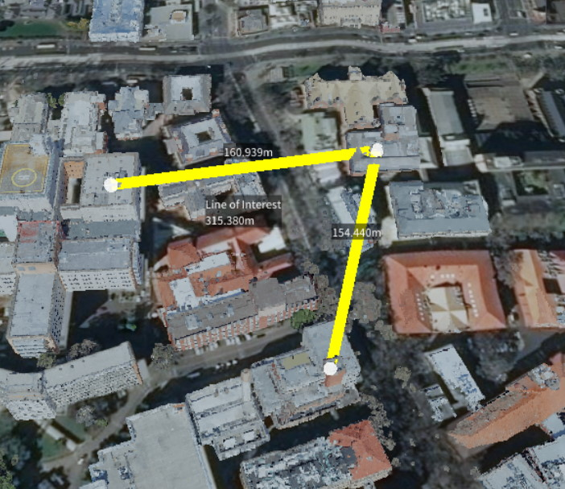

# Measurements

A Line Measurement is a series of connected points in the scene, useful to visualise boundaries and measure distances.

To begin a line measurement click on the line measure icon in the tool panel and click in the scene to place line nodes. A panel will appear in the top right with a few options, and information about the line measurement. See below for a description.

  - **Show Length** Display the cumulative length of the line segments.
  - **Show All Lengths** Display the individual lengths of each of the line segments.
  - **Show Angles** Display the angles between joining line segments.
  - **Show Area** Display the area encompassed by the line segments. The area is calculated by first meshing the point set, then totaling the area of each triangle in the mesh. To give a correct area, the shape should be simple, that is cannot contain lines that cross over. Note: the Close Polygon option must be selected for an area to be calculated.
  - **Close Polygon** Join the first and last points, thereby creating a 'closed' shape.
  - **Line Width** Set the width of the line in the scene.
  - **Line Orientation** There are three options to choose from: Screen Line, Vertical/Fence and Horizontal/Path. The Screen Line is simply a basic single-colour line drawn on the screen. The Vertical/Fence and Horizontal/Path options with create a vertical and horizontal oriented line object, respectively. These options are helpful when looking at the line from different angles.
  - **Line Colour** Set the colours of the line.
  - **Selected Point** Move the slider to select a node in the line. Once selected, you can manually change the position of the node by setting the x-y-z coordinates or remove the node from the line. A value of -1 selects indicates all points are selected.
  - **Text Colour / Background Colour** Set the colours of the text displayed along the line in the scene.
  - **Description** Add a description to the line. This will be saved out with the project.

> Right clicking on the name in the scene explorer will bring up a context menu with additional options.

  - **Edit Name** Change the name of the line.
  - **Move To** Move the camera such that the line is in view.
  - **Fly Camera Through All Points** This option will begin a fly-through of all points along the lines. The fly-through speed is determined by the Camera Move Speed. If the Close Polygon line setting is checked, the fly-through will repeat until cancelled.
  - **Attach Model** A model can be attached to a line, and will continuously move along the segments of the line. This is useful for vehicle or flight paths. Once attached, more options will become available in the scene explorer under the respective line. These are used to control the speed of the model and set the type of face culling.
  - **Remove Item** Deletes the item from the scene.
