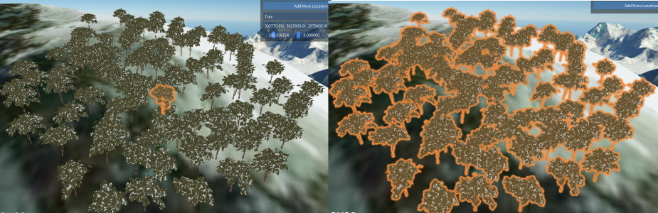
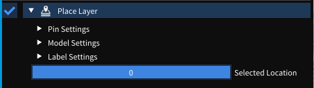
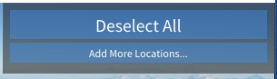
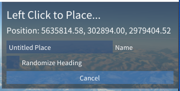
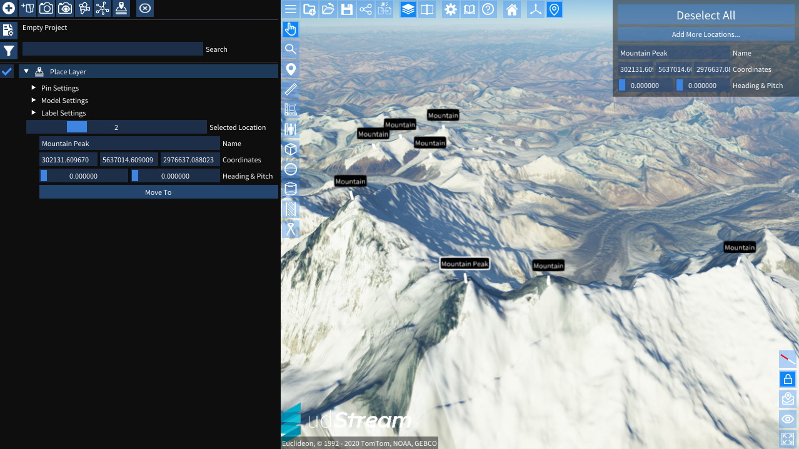
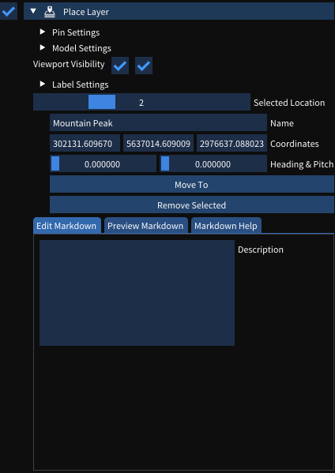

# Places

A place layer is a collection of points that can be displayed with a label, a model or both.

They are intended to be used in when at least one of the following situations occurs:
  - There is a requirement to display multiple copies of the same model in an efficient manner (trees, parking meters, stop signs, etc) or;
  - A lot of related annotations that the user would like to be able to enable and disable in a single layer.

Adding a new place layer can be done by clicking the  Add Place Layer button at the top of the [Scene Explorer](./explorer.md).

After it has been added to the scene it will look like this:  

## Adding more Places

To add more places to the scene, follow these steps.

  1. In the scene explorer, expand the Place Layer you want to add points to
  2. In the top right corner of the scene, the embedded UI will display
    
  3. Clicking "Add More Locations..." will start the placement mode and the scene UI will now show this.
    
  4. The "Name" field will be used to fill in the name of the places that are created.
  5. "Randomise Heading" can be used to set the heading to a random value. This is particularly useful to avoid repetitive patterns when placing objects like trees or other vegetation.
  6. Clicking in the scene will create a new place at that location.
  7. To stop placement mode, press "Escape" (by default), start using a new tool (like Measurement) or click "Cancel" in the embedded UI in the top right of the scene

## Updating the details on individual Places

There are two main ways to modify the details of an individual place.

In the [scene](./scene.md):
  1. Click on the label or model (as applicable) of the place that needs to be modified.
  2. The model and label (as applicable) will highlight in the scene
  3. The embedded UI in the top right of the scene will display the selected node where fine tuning can occur.

In the [scene explorer](./explorer.md):
  1. In the expanded options for the Place Layer, drag through the "Selected Location" slider until you find the desired item.
  2. The Place can be modifed immediately underneath the slider and the "Move To" button can be used to move the camera to the selected Place.

> Note! With an individual model selected, it is possible to fine tune using the [Gizmo](./gizmos.md) controls.

## Removing an individual Place

An individual place may be removed by clicking the "Remove Selected" button in the scene explorer while the place is selected.

## Place Settings

There are 3 main groups for settings. The "Pin Settings", "Model Settings" & "Label Settings". These can be found in the [scene explorer](./explorer.md) after expanding the Place Layer.

### Pin Settings

The pin settings are used to control how the Places group together when far away.

  - If the **Pin Image URL** is set, it will be displayed when Places are beyond the global "Maximum Label Distance" in settings.
  - **Maximum Pin Distance** sets the threshold at which Places will no longer be represented using the Pin Image and will no longer be visible in the scene.

### Model Settings

The model settings control the polygon model that is displayed at each Place.

  - **Model URL** sets the URL for the polygon model, ensure that CORS is configured and users will be able to access the model. OBJ is the recommended format.
  - **Model Position** moves the pivot for the model, this is necessary when the model is off-centre.
  - **Model Rotation** is used to fix models that are not rotated so that X faces East, Y faces North and Z faces Up.
  - **Model Scale** gives X, Y, Z controls to fix scale issues with imported models.
  - **Tint** can be used to tint all instances of the model.

> Note! As with all colour pickers, the gradient colour picker for **Tint** can be right clicked to enter HSV mode.

### Label Settings

The label settings controls the

  - **Show Labels** can be used to enable & disable the label entirely
  - **Show Lines** will enable & disable the line between the Place position and the label
  - **Label Height** sets the distance above the position that the label will display
  - **Background Colour** changes the backing colour of the label. The "Alpha" channel can be used to have transparent labels.
  - **Text Colour** changes the colour of the text on the label.
  - **Line Colour** changes the colour of the line between the position and the label.
