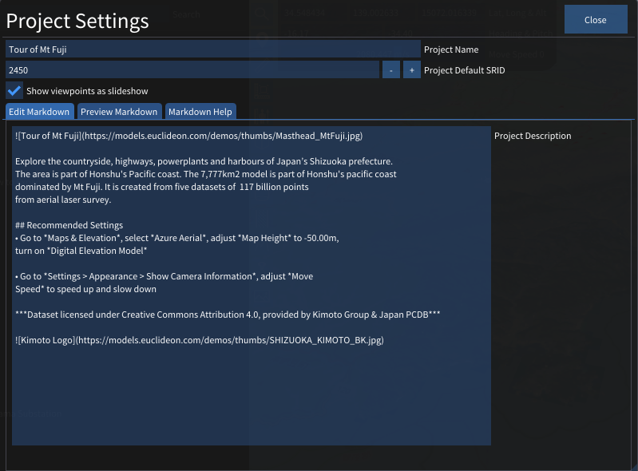
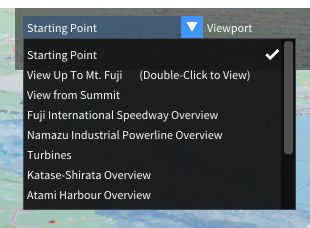
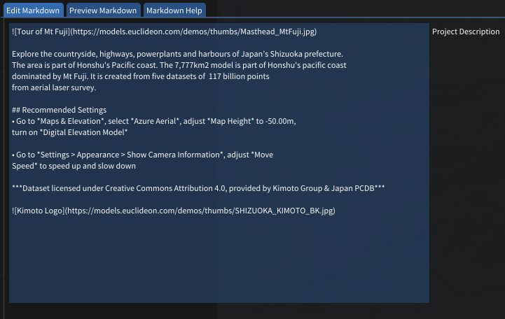
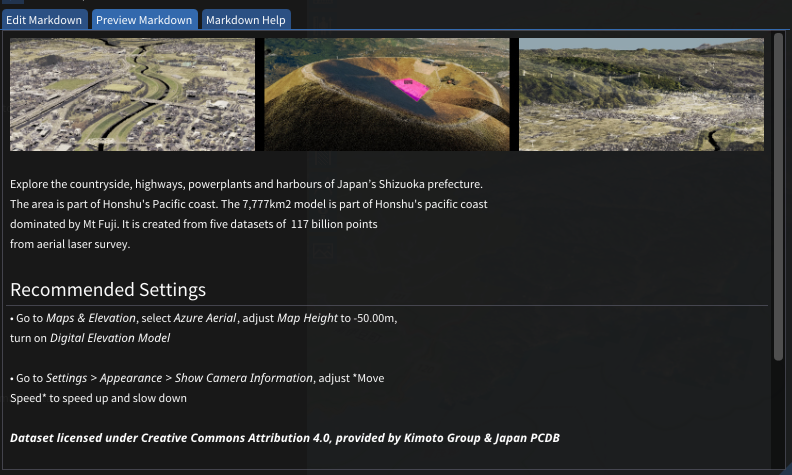
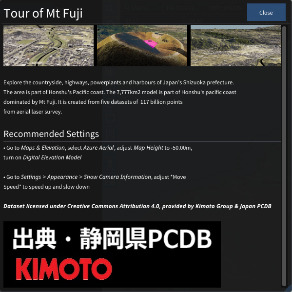

# Project Settings

Project settings can be used to set the information of the project.

## Project Name
Project name is displayed in the Scene Explorer window and can be duplicated.

## Project default SRID
Also used as a recommended SRID.

## Show viewpoints as slideshow
Toggle slideshow pannel(top right corner).

## Markdown script
UdStream supports Markdown script for creating project information. You can edit your Markdown script and browse effect in "Preview Markdown".

### - Edit

### - Preview

### - Information Window

