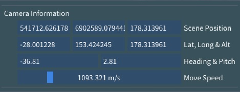

# Scene Viewport

These settings are configurable in Input & Controls. See section [Settings](./settings.md).
You can use specific keys, with the "Scene" window focused, to control the camera movement.

Default Mouse Controls:
  - **Tumble** Hold down the left-mouse button and move the mouse left-right-up-down to rotate within the display and change the angle of your view. You will not travel with the tumble action.
  - **Pan** Holding the right mouse button on a point in the scene (not the skybox) will begin "panning" (moving the camera, but not turning the camera. It will keep the originally hovered point under the mouse cursor.
  - **Orbit** Hold down the mouse scroll wheel as you move the mouse. The mouse movement will give you the sensation that you are orbiting around the point you selected. This feature is based on where you first click on the screen and will keep the camera the same distance from the clicked point by turning and moving the camera.
  - **Dolly** The mouse scroll wheel will "dolly" (zoom the camera in and out) from the point where the mouse is hovering (will not work with the skybox).

> If you prefer the Euclideon Geoverse MDM method of using the Scroll Wheel to change the mode speed, then that option is available in Settings > Input & Controls > Mouse Pivot Bindings.

## Default Keyboard Controls
  - **W and S** manoeuvre the camera forward and backward at the current Camera Move Speed.
  - **A and D** pan the camera left and right at the current Camera Move Speed.
  - **R and F** ascend and descend the camera at the current Camera Move Speed.
  - **Spacebar** locks altitude, allowing you to pilot the camera without changing the camera's height (Z-axis lock).

You can adjust the Move Speed blue bar in the Scene Info & Controls panel. This setting is persistent across sessions.

> In addition to mouse/keyboard controls, the camera can also be moved using an Xbox Controller or equivalent gamepad/controller device.

## Default Gamepad Controls
- **Left Analog Stick** Move forwards, backwards and strafe left and right at the current move speed
- **Right Analog Stick**: Rotate Camera (look around)
- **Left Trigger**: Move Down (lower altitude) at the current move speed
- **Right Trigger**: Move Up (higher altitude) at the current move speed
- **A Button** Toggle Lock Altitude
- **B Button** Slow down camera (x0.5)
- **Y Button** Speed up camera (x2)
- **X Button** Swaps between left and right viewports

Note: Development testing is done using a Microsoft Xbox 360 controller, these controls might be mapped differently on other brands or styles of controllers.

## Default Hotkeys
  - **F5**: Toggles full screen mode on and off.
  - **Ctrl+U**: Opens a popup for adding additional files.
  - **Delete**: Removes the selected items from the scene

## Copyright and Compass

Copyright data will be displayed in the bottom-right corner of the viewport. You can add Copyright Data to new models in the metadata textbox during conversion.
