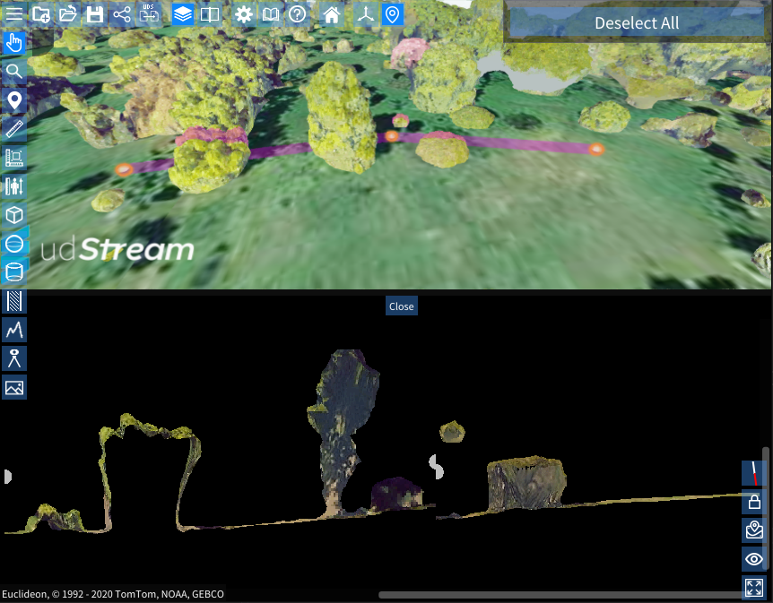
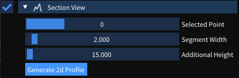

# Section Views

A section view is a polyline through the scene that is displayed as a contiguous cross-section along the polyline. This is a useful tool to visualise elevation differences between different scene elements.

To add a Section View, select the section view button, and select as many points as you like. The Section View image will be generated between each point, and displayed in a new window.

You can reopen the section view window by expanding the section view in the scene explorer, and pressing the "Generate 2d Profile" button.

