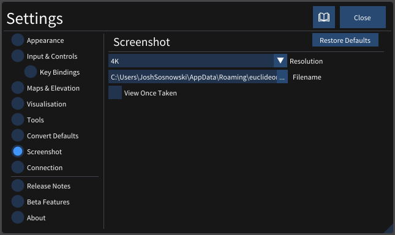
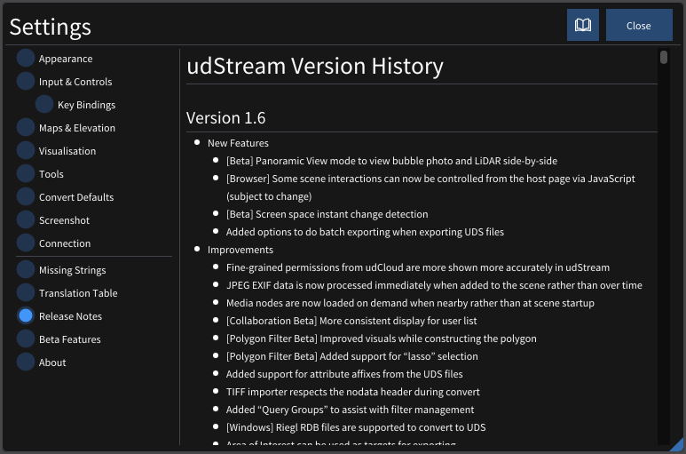

# Settings

 Here is where you can customise how the udStream looks and operates.

> To restore all default values for any of these settings, simply click on the area on the left and then select "Restore Defaults" at the top.

The settings are grouped into categories down the left side of the pop-up.

## Appearance

The Appearance values enable you to adjust several settings that change the appearance of the udStream interface.

  - **Language** changes the language of the application. Please note that many of the language selections are translated using machine translation.
  - **Application Complexity** removes elements to provide a simpler or less cluttered experience.
  - **User Interface Scale** Applies a multiplier to the scale of all user interface elements between 1.0 and 1.5.
  - **Units of Measurement** sets the measurement system to use. Currently Metric and US Survey are supported.
  - **Show Camera Information** will display camera information such as latitude/longitude, heading/pitch and camera speed in the top left of the [scene](./scene.md).
  - **Show Projection Information** enables the display of projection information including the SRID and the mouse position in the top left of the [scene](./scene.md).
  - **Show Euclideon Logo** will display the Euclideon logo at the bottom left of the [scene](./scene.md).
  - **Map Mode Viewport** Select which viewport displays in map mode when "Toggle Viewport" (see [Scene Explorer](./explorer.md)) is enabled.
  - **Show Advanced GIS Settings** enables the display of the advanced GIS settings in the top-right corner of the scene. This can be used to force the camera into a particular SRID.
  - **Show Diagnostic Information** Check the box to display diagnostic information throughout the application. Such as the frame rate. The system will display the frame rate in frames per second (FPS) and milliseconds (ms) on the top menu bar next to the license and username information. Diagnostic information for Live Feeds includes Total Cached Items, Number of items displayed, Next Update.
  - **Maximum Label Distance** controls the maximum distance at which Labels (from Points of Interest, [measurements](./measuring.md), [Places](./places.md), [GTFS](./gtfs.md), etc) are visible. If this value is low, you will not be able to see those labels when zoomed further away. This is useful both to improve performance and also to declutter the scene.
  - **Image Rescale Distance** Media nodes (images, panaroma's and photospheres) will start to shrink and disappear when this distance away from the camera.
  - **Limit FPS In Background** Enable this to limit the frame rate when the application does not have input focus. This will reduce the impact of udStream while actively using other applications. This will not slow down conversion jobs.
  - **Show Native Dialogs** Show your operating system's native dialog windows when you save or load a file.
  - **Layout** Choose which side of the screen you would like the Scene Explorer.
  - **Performance/Quality** Modifies the Quality of the rendering window(s). A lower number reduces the resolution and increases performance. 1.0 is standard quality.
  - **Voxel Count** (GPU Renderer Only) Modifies the number of voxels rendered. A lower number reduces the visual quality, but improves performance.
  - **Block Priority Threshold** (GPU Renderer Only) Modifies the size of the voxels rendered. A lower number increases the visual quality, but reduces performance.

> For settings that are controlled via a slider, you can press Ctrl+click on the slider and manually enter a value, allowing you to enter a more precise value or, in some cases, extend the slider value beyond its min and max range.

## Input and Controls

Expanding this panel allows you to change settings that affect how you interface with the udStream.

  - **On Screen Controls** You can toggle on-screen mouse controls, which will appear at the bottom-left of the Scene window. Click and drag the blue bar in the U/D box to move the Scene up or down. Click inside the Move Camera box and drag the mouse out. You will see a line appear from within the box. The camera position and rotation is controlled by how far you draw out and in which direction you drag this line. 
    
  - **Touch Friendly UI** You can enable udStream to recognise touchscreen devices.
  - **Invert Mouse X-axis** & **Invert Mouse Y-axis** Check to invert the default camera movement when you drag the mouse along the X and Y axes.
  - **Invert Controller X-axis** / **Invert Controller Y-axis** Check to invert the default controller axis.
  - **Mouse Snap to Points** Have the mouse snap to points.
  - **Mouse Pivot Bindings** You can customise the mouse-controlled camera movements. Find the descriptions of the different mouse pivot bindings in the Default Mouse Controls section.

> To enable/disable maps, see section "Maps and Elevation".

## Key Bindings

This section allows you to set up your own key bindings. Simply click an action to want to bind and press the key you want have bound.

## Maps and Elevation

The map feature is useful when you need a geospatial view and are unfamiliar with the area or are looking for a specific reference point. Select Map & Elevation within the Settings tab.

- **Map Tiles** Toggles the map system. Enabling the mapping system will increase network usage.
- **Keep Camera Above Ground** Checking this will ensure the camera will never go below the maps surface (if they are enabled).
- **Digital Elevation Model** Adds height data to the map system. Enabling the map height data will increase network usage.

> Hold down the Ctrl-key and click in any parameter that has a slide bar to manually set a more precise value or set a value outside the parameter boundaries.

## Visualisation

The Visualisation panel allows you to change some of the visual aspects of udStream, as well as visualise your data in different ways.

### Display Mode

The Display Mode drop down list allows you to view the different types of data or 'channels' associated with your datasets. This including Colour, Intensity, Classification and Displacement, GPS Time, Scan Angle, Point Source ID Return Number and Number of Returns. Note: not all datasets will  contain all these channels.

- **Colour** Colour is the default display mode.
- **Intensity** Intensity refers to the strength of the laser pulse that generated a point. Use 'Min Intensity' and 'Max Intensity' to set the intensity range you want to view.
- **Classification** In this mode, a checkbox appears which enables you to customise the colours of objects corresponding to their designated classifications. Unchecking the box beside a specific classification will disable that classification class.

> There is a "Enable/Disable All" to quickly enable or disable all classifications.

- **Displacement Distance** Set the range at which you want to view the displacement between two models. You can also set the colours corresponding to maximum and minimum displacement, as well as set the colour for displacements outside of this range.
- **GPS Time** This setting allows you to visualise the times at which your data was scanned. Time is typically stored as a single number, representing the number of seconds since a specific point in time, or 'epoch'. For most laser scans, this is typically 'GPS Time' or 'Adjusted GPS Time'. GPS Time is the number of seconds since the midnight the 6^th^ of January 1980, and GPS Adjusted Times is GPS Time minus one billion.
You will need to tell udStream how to interpret this number, by choosing either choosing GPS or GPS Adjusted from the dropdown box. You can also set the range of time you wish to visualise.
- **Scan Angle** For data sets created by a laser scanner, the scan angle is the angle at which the laser leaves the scanner, from -180° to 180°, where 0° is directly in front of the scanner. You can refine the range by adjusting the Minimum Angle and Maximum Angle.
- **Point Source ID** Sometimes, each point in the dataset may have an associated number, or ID to identify where the data came from. This could mean any number of things but commonly is linked to the location of the dataset. Follow these steps to build up a list of IDs you want to visualise:

    - Set 'Next ID' to the ID you want to register
    - Set the colour associated with this ID
    - Press 'Add' to add the ID to the list of currently registered IDs.

Any IDs that are not registered will use the 'Default Colour.' You can remove an ID by pressing the  next to the list item. Click Remove All to clear the list.

- **Return Number** A laser pulse can return up to 6 times when scanning a feature. It is sometimes useful to know which *return number* is associated with each point in the dataset. In this display mode, you can associate a different colour with each return number.

- **Number of Returns** This signifies how many times the laser pulse was returned when scanning a feature. There is a maximum of 6. The colour of each can be set in this display mode.

- **Custom Attribute** This allows for the visualisation of scalar attributes of the model using a linear mapping to a number of preset schemes. This can be applied to any attribute present in the dataset.
Selecting this mode will open the following submenu:

Before using the feature the **attribute name** and **slider range** need to be set to one appropriate to the attribute being visualised.
The colour scale will be applied linearly along the range defined by **min** and **max**. The colour mapping can be optionally repeated to achieve a contour effect using the **repeat scale**. Colour scales ending in a capital O (e.g. BrocO) are best used with when creating contours in attributes to create smooth transitions between repititions.

To determine the range of values that a scalar value in a particular model for setting the min and max, first open the model in the **scene explorer** by clicking on the arrow next to the model name and scroll to find the values for *AttrMinMax* in the model properties:

### Other Visualisation Settings

- **Voxel Shape** Set the shape of voxels in the Scene window as either points, rectangles, or cubes. Euclideon recommends rectangles for accuracy and performance.
- **Camera Lens (fov)** Field of View. This controls the horizontal extents of the scene displayed on the screen.
- **Near Plane** / **Far Plane** These set the nearest/furthest distance values for rendering objects in the scene before they're clipped from view.
- **Saturation** Used to control the colour saturation of the scene.
- **Skybox Type** This changes the visualization of the sky and surrounding atmosphere. The options include:
  - **None** The sky will be displayed black
  - **Colour** Set your own sky colour
  - **Simple** A simple texture of a blue sky with clouds
  - **Atmospheric** atmospheric colouring, taking into account the time of day. You can adjust the time of day, time of year and the brightness of the sun.
- **Sun Brightness** Use the blue bar slider to change the sun brightness effect effect applied to the scene. (Only visible if the "Skybox Type" is set to "Atmosphere")
- **Anti-Aliasing Type** Select the Anti-Aliasing mode for rendering. 
- **Use System time for sun position** Sets the sun's position based off the users local time.
- **Lock time to camera position** Sets the scene to always be day time.
- **Time of Day** & **Time of Year** Set the sun position to a specific time and day.
- **Enable Selected Objects Highlighting** Selected objects will now be highlighted in the scene, using the specified Highlight Colour and Highlight Thickness.
- **Enable Edge Highlighting** Highlights the edges of every voxel in the scene, using the specified width and colour. The threshold determines how to resolve the edges of overlapping voxels.
- **Enable Colour by Height** Displays colours along the specified two-colour gradient to all objects in the scene based on their height.
- **Enable Colour by Distance To Camera** Displays colours along a one-colour gradient to all objects in the scene based on their distance from the camera.
- **Enable Contours** Displays elevation contours depicted by Contour Colour on all objects. Contours Band Height is the width of the Contour Distances in the vertical space between each contour.

The last five display options also allow you to customise the colours.

> If you changed a setting and can't recall what you've changed, you can reset all settings by going to the System menu and selecting Restore Defaults, or you can reset individual groups of settings by right clicking on their header in the Settings Window and selecting Restore Defaults.

> All parameters in the Settings Window are persistent across sessions: If you log out and log back in, the system will restore your settings from the previous session.

## Tools (Default Settings)

Here you can set the default settings for the udStream tools.

- **Line Width** Set the line width for all new line measurements you add to the scene.
- **Line Orientation** Set the line orientation for all new line measurements you add to the scene.
- **Line Style** Choose whether you want new measurements to be placed as screen lines, fences, or horizontal paths.
- **Line Colour** Set the line colour for all new line measurements.
- **Fill Colour** Set the fill colour for all new area measurements.
- **Text Colour** Set the text colour for all new line measurements.
- **Background Colour** Set the text background colour for all new line measurements.

## Convert Defaults

Converting is a process where a point cloud or 3D model is converted into Euclideon's own file format, UDS. In this section you can set some default settings when you convert your files.

- **Temp Directory** The process of conversion requires temporary files to be written to disk. You can set the location here.
- **Author, Comment, Copyright and License** These are optional fields you can add as metadata to your dataset when you convert.

## Screenshot

Pressing the PrtScn Key will take a screenshot of the current Scene Viewport and place it into a folder of your choosing.

- **Resolution** Set the resolution of your screenshots
- **Filename** Choose the path you wish to save your screenshots
- **View Once Taken** Display the image in a separate window each time you take a screenshot

## Connection

Here we can set various connection settings.

- **Proxy Address** The address for your internet proxy (this is provided by your system administrator). It can additionally include the port number and protocol. Examples include: 192.168.0.1, 169.123.123.1:80 or https://10.4.0.1:8081.Leaving this blank will attempt auto-detection.
- **User Agent** A field included in HTTP request headers. Very few users will need to specify this setting.
- **Ignore Certificate Verification** Will disable verification of the PEER and HOST certificate authorities. This setting should only be used when instructed by your system administrator and only when errors are occurring during the login process, as it will weaken the security between your computer and the udServer. NOTE: Ignore Certificate Verification will not be saved due to the security risk associated. You will need to enable this setting each time you open the application.
- **Require Proxy Authentication** If you require Proxy Authentication, Set the username and password here.

## Missing Strings

> This option is only available with "Show Diagnostic Information" enabled in Appearance

Here we can view all missing translation strings that have attempted to be loaded. This is a helper system similar to the "Translation Table" to help identify missing translations.

## Translation Table

> This option is only available with "Show Diagnostic Information" enabled in Appearance

This is a helper system for the community to work to improve the translations.

There are three columns;
- The left-most column displays the key for the string
- The middle column is the current translation in the official language pack ("Australian English" or en-AU).
- The right-most column is the current translation in the language pack specified at the top. Clicking in this column will open the editor for that string, pressing Enter or clicking away will submit the translation.

The "..." button provides quick access to the included language packs or a new language pack can be created by entering the code in the text field at the top.

- **Hide Unchanged Strings** will hide strings that didn't change in the most recent release.
- **Show Change Status** will display some information at the end of the key based on the status of that key in the most recent release (versus the release before that)
  - "New": The string is new in this release and will need to be translated
  - "Changed": The string was changed in the offical language pack in this release and may no longer be the correct translation
  - "Same": The string was unmodified in this release

At the very bottom (under the 3 translation columns) there is a section showing keys that no longer exist in the official language pack- these can be safely removed. Clicking "Remove all deleted" will remove them from the table above (you must still click "Save" before the on-disk version is updated).

After you are happy with your modifications, you can click "Save" to save the new translations to file. These language packs are stored in the assets/lang directory of the application, you are welcome to submit the pack back to support@euclideon.com to be included in the next release!

> Note! The language pack will not reload automatically, you must go back to "Appearance" and click the language from the drop-down again for your changes to apply.

## Release Notes

View all new features, improvements and fixes between udStream releases.

## Beta Features

The Beta Features are experimental tools and options intended as previews for upcoming features. These are intended for advanced users. It is recommended you back up your data before using them.

  - **Multi-User Collaboration** Enables multi-user collaboration in udCloud scenes. This feature enables you to view other users and interact with the udCloud scene project wit them.
  - **Allow comparison of screen displacement** Enables the screen displacement visualization tool. This feature compares the depth of a selected UDS with the rest of the scene.
  - **Display Polygon Filter Tool** Enables the Polygon filter tool. The polygon filter tool is a drawable shape that filters the scene to only display what's within the shape (similar to the box and sphere filter tools).
  - **Lasso filter** When enabled, causes creating a Polygon Filter to draw the shape at the camera position instead of pinning the shape nodes directly on the terrain.
  - **Allow extruding an Area to a Volume** Adds an 'Extrusion' option for area measurements which allows you to extend their volume.
  - **Side-by-Side panoramic viewer** Enables Panorama mode. This mode displays a side-by-side viewer that allows the user to cycle between panoramic images in a project.
  - **GPU Renderer** Enables rendering unlimited detail models (UDS) using Graphics processing unit (GPU) instead of Central processing unit (CPU).

## Settings On Disk

We mentioned in Visualisation that your interface settings are persistent across sessions, and this is because udStream stores that information in a settings.json file, the location of which is dependent on your operating system.

  - **Windows**: %AppData%/Roaming/Euclideon/client/settings.json
  - **macOS**: \~/Library/Application Support/euclideon/client/settings.json
  - **Linux**: \~/.local/share/euclideon/client/settings.json
