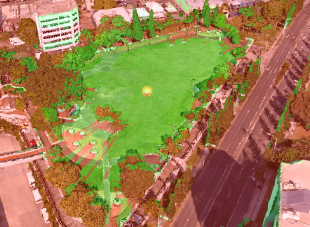
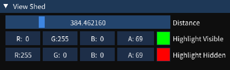

# Viewsheds

A view shed is the set of all points that are visible from a location. It includes all points that are in direct line of sight to the location and excludes points that are obstructed by terrain and other features.

To add a viewshed in the scene, right-click a point in the scene, choose Add New Item  and then Add View Shed . It should look something like below, where visible points are green and hidden are red. You can change the colour of visible and hidden points, as well as set the projection distance in the scene explorer.

